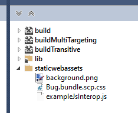

# GeneratePackageOnBuild with TypeScript bug

When using TypeScript and GeneratePackageOnBuild together causes the following on the second build:

```console
Two assets found targeting the same path with incompatible asset kinds
```

## Reproduce

## Create Razor class library

First lets create a new Razor/Blazor class library.

```powershell
dotnet new razorclasslib -n Bug
```

confirm it builds

```powershell
cd .\Bug\
dotnet build
```

## Enable pack on build

Open the `csproj` file and add the `GeneratePackageOnBuild` property inside of the `PropertGroup`:

```csproj
<GeneratePackageOnBuild>true</GeneratePackageOnBuild>
```

```powershell
dotnet build
```

### Confirm NuGet creation

Open the generated NuGet using [NuGet Package Explorer](https://apps.microsoft.com/store/detail/nuget-package-explorer/9WZDNCRDMDM3?hl=en-us&gl=us)

confirm the `staticwebassets` are included in the NuGet



## Add some TypeScript

Create a directory for our TypeScript files and navigate into it.

```powershell
mkdir ts
Push-Location ts
```

Create `hello.ts`

```powershell
New-item "hello.ts" -Value "console.log('Hello World');"
Pop-Location
```

## Add TypeScript build tools

We need to be able to transpile the TypeScript to JavaScript and put it in the `wwwroot` folder. Lets add the tooling to do this.

```powershell
dotnet add package Microsoft.TypeScript.MSBuild --version 4.8.4
```

Configure the TypeScript build output for the `wwwroot` folder by setting the `TypescriptOutDir` property inside of a `PropertyGroup` in the project file:

```csproj
<TypescriptOutDir>wwwroot</TypescriptOutDir>
```

Include the TypeScript target as a dependency of the `PrepareForBuildDependsOn` target by adding the following target inside of a `PropertyGroup` in the project file:

```csproj
<PrepareForBuildDependsOn>CompileTypeScript;GetTypeScriptOutputForPublishing;$(PrepareForBuildDependsOn)</PrepareForBuildDependsOn>
```

Now confirm that when we build the project it creates a `hello.js` file in the `wwwroot` folder.

```powershell
dotnet build
```

Confirm the NuGet contains `staticwebassets` using NuGet Package Explorer.

## The Error

Now run dotnet build again.

```powershell
dotnet build
```

You will see the following error:

```console
 Two assets found targeting the same path with incompatible asset kinds
```

## Workaround

Set GeneratePackageOnBuild to false and ensure you do a `dotnet clean` prior to running `dotnet pack`.

### References

https://learn.microsoft.com/en-us/aspnet/core/razor-pages/ui-class?view=aspnetcore-6.0&tabs=visual-studio#typescript-integration  
https://learn.microsoft.com/en-us/visualstudio/javascript/compile-typescript-code-nuget?view=vs-2022  
https://apps.microsoft.com/store/detail/nuget-package-explorer/9WZDNCRDMDM3?hl=en-us&gl=us  
https://github.com/dotnet/aspnetcore/issues/42110
